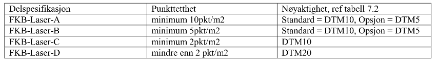
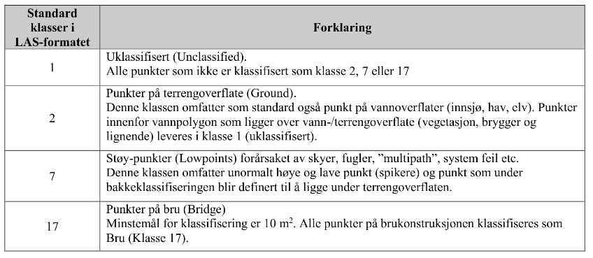
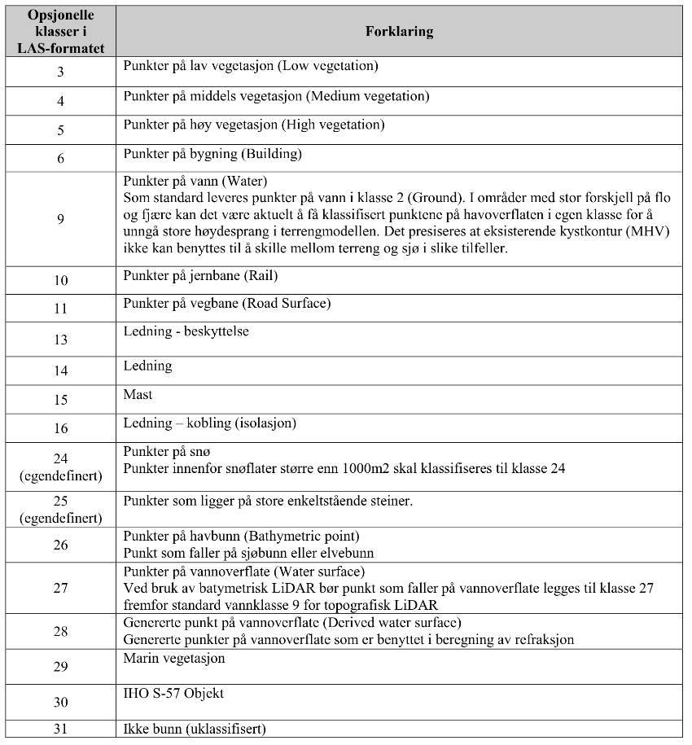

# 3d
3D models from moi to doi

# LiDAR Point Clouds
This model was made from LiDAR-data found here. Had to be ordered on the site and received on mail. Can take some time to generate data.

https://hoydedata.no/LaserInnsyn/

The received data-sets is found in the folders for each location.

The data is in .laz format, which is an compressed format of LAS. No wories, can be directly imported with CloudCompare. (seemlessly sequieing to ... )

# Tools
I've used CloudCompare to do cleanup of the cloud and to generate a mesh of the surface. Be warned: To be able to use the meshing tools (that is dependent on some wacky math library that debian doesnt like to have in its package depository (dont fact check this)) i had to use snap to install it. Another neat feature i found is removing points based on their Scalar Fields properties. Somehow the LiDAR gets different properties from trees than it does from city-stuff, and that was used to clean up some spiky tree structures.

When i had a mesh of the surface i use FreeCAD to create a primitive qube that slightly touched the base of the surface of the city and used 'Make compund' on the two shapes. Saved the file as .stl and loaded it into the 3d printer generic printer software, and it actually worked. The model still have some spikyness, but as Sonata Arctica put it:

```
Good enough was good enough for me
As it should always be
```

# Tables for LAS-data







# CloudCompare Screenshots

